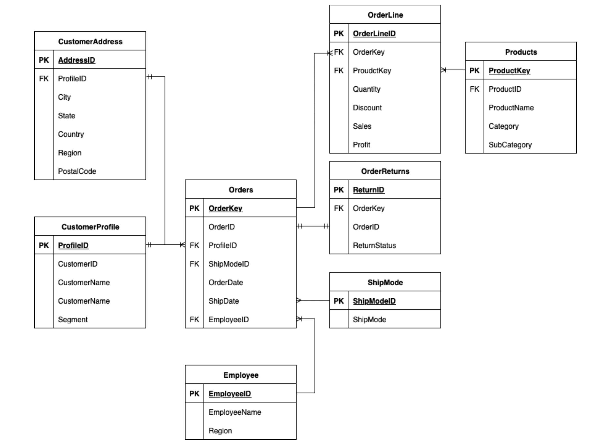
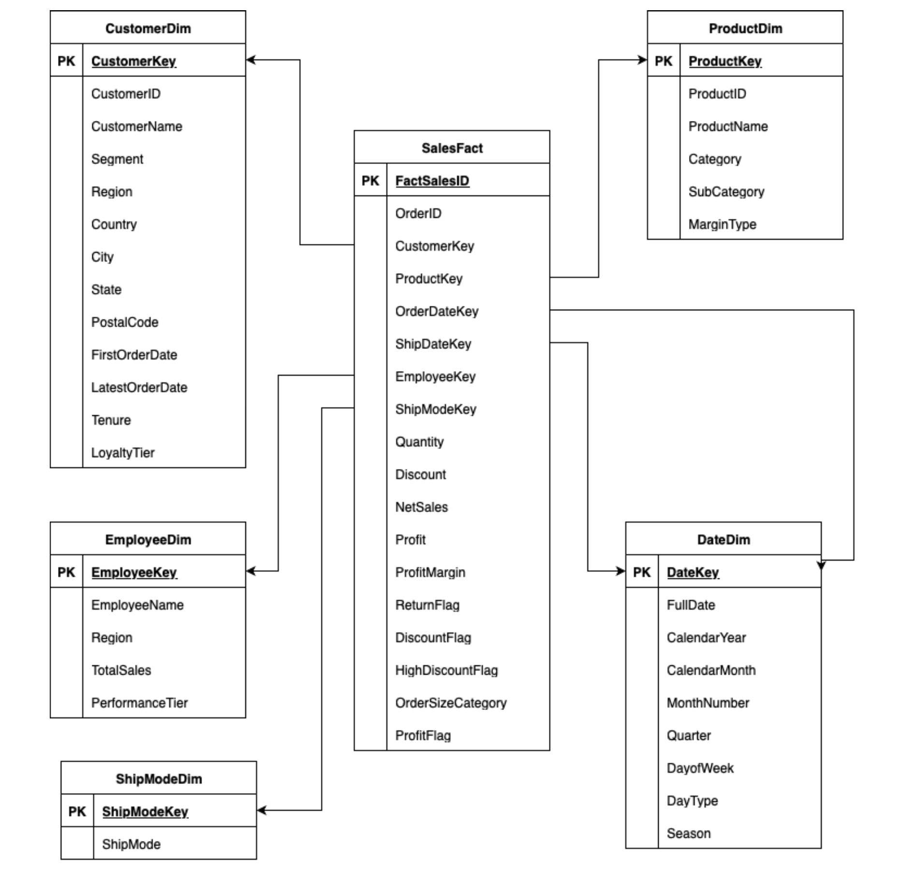

# Superstore Retail Sales Data Warehouse

## Project Overview

This project presents the **design and implementation of a retail data warehouse** for analysing Superstore sales data. The solution transforms raw transactional data into a structured analytical model to support **reporting and business insight generation**.

The project demonstrates an **end-to-end data warehousing pipeline**, covering source data ingestion, schema transformation, dimensional modelling, ETL design, and analytical reporting using industry-standard tools.

## Objectives

The primary goals of the project are to:

- Design a **scalable and maintainable data warehouse** using dimensional modelling
- Enable analysis of **customer behaviour, product performance, employee efficiency, and returns**
- Support **OLAP-style analysis** and automated reporting
- Demonstrate best practices in **ETL design, schema design, and derived business logic**

## Source Data

The warehouse is built using the **Superstore dataset**, sourced from three CSV files:

- superstore.csv
- superstore_employees.csv
- superstore_returns.csv

The dataset contains structured retail data across multiple business domains, including:

- Orders and order line items
- Products and categories
- Customers and addresses
- Employees and regions
- Shipping methods
- Returns

## Data Architecture Overview

The solution uses a **three-layer architecture**:

### 1. Source Layer
Raw CSV files loaded into a base database (SuperStore_dataset) without modification.

### 2. Normalized Staging Layer
A relational schema (OrderManagementDB) designed to:
- Reduce redundancy
- Enforce referential integrity
- Prepare data for dimensional modelling

Core tables include:

- CustomerProfile, CustomerAddress
- Employee
- Products
- ShipMode
- Orders, OrderLine
- OrderReturns

### 3. Data Warehouse Layer
A **star schema** implemented in the SalesInsights_DW warehouse for analytical querying and reporting.

### The full data flow is:

1. Raw CSV files are loaded into the source database, `SuperStore_dataset`.
2. Data is transformed into normalized relational tables in `OrderManagementDB`.
3. Dimension and fact tables are loaded into the data warehouse, `SalesInsights_DW`.
4. SSRS reports are generated from the completed data warehouse.
   
## ERD Design

The normalized staging database was designed to organise the raw Superstore data into relational entities before loading it into the data warehouse.

  

The ERD includes customer, address, product, employee, shipping, order, order line, and return entities. This structure reduces duplication, enforces relationships between tables, and prepares the data for transformation into dimension and fact tables.

## Star Schema Design

The final warehouse uses a **star schema** implemented in `SalesInsights_DW`. At the centre of the model is the `SalesFact` table, surrounded by five dimension tables.

  

### Dimension Tables

| Dimension Table | Description |
|---|---|
| **CustomerDim** | Stores customer attributes, location details, first/latest order dates, tenure, and loyalty tier |
| **EmployeeDim** | Stores employee details, region, total sales, and performance tier |
| **ProductDim** | Stores product category, subcategory, product name, and margin classification |
| **DateDim** | Provides calendar attributes such as day, month, quarter, year, season, and day type |
| **ShipModeDim** | Stores standardised shipping method information |

### Fact Table

The **SalesFact** table captures transaction-level sales metrics and links to the dimension tables using surrogate keys.

Key fields include:

- Sales, quantity, discount, and profit
- NetSales and ProfitMargin
- ReturnFlag, DiscountFlag, HighDiscountFlag, and ProfitFlag
- OrderSizeCategory
- CustomerKey, ProductKey, EmployeeKey, ShipModeKey, OrderDateKey, and ShipDateKey

This design supports flexible reporting across customers, products, employees, time periods, shipping methods, returns, discounts, and profitability.

## Derived Business Logic

Several derived attributes were created during the ETL process to make the warehouse more useful for analysis and reporting.

| Derived Attribute | Location | Purpose |
|---|---|---|
| **Tenure** | CustomerDim | Calculates the number of years between a customer’s first and latest order |
| **LoyaltyTier** | CustomerDim | Classifies customers as New, Regular, or VIP based on tenure |
| **PerformanceTier** | EmployeeDim | Categorises employees as Low, Average, or High based on total sales |
| **MarginType** | ProductDim | Identifies whether a product has strong profit margin performance |
| **NetSales** | SalesFact | Calculates revenue after discount: `Sales - (Sales × Discount)` |
| **ProfitMargin** | SalesFact | Calculates profit as a percentage of sales |
| **ProfitFlag** | SalesFact | Classifies each transaction as Profit, No Profit, or Loss |
| **DiscountFlag** | SalesFact | Indicates whether a discount was applied |
| **HighDiscountFlag** | SalesFact | Identifies transactions with high discount levels |
| **OrderSizeCategory** | SalesFact | Classifies orders as Small, Medium, or Large based on quantity |
| **ReturnFlag** | SalesFact | Indicates whether an order was returned |

These fields are calculated during ETL rather than manually inside reports. This keeps business logic consistent across SSRS reports and avoids repeated calculations at the reporting layer.

## ETL Strategy

The ETL process follows this load order:

1. Raw CSV files are loaded into the source database, `SuperStore_dataset`.
2. Clean relational tables are created in the normalized staging database, `OrderManagementDB`.
3. Dimension ETL packages load `CustomerDim`, `EmployeeDim`, `ProductDim`, `DateDim`, and `ShipModeDim`.
4. Lookup transformations retrieve surrogate keys from the dimension tables.
5. The fact ETL package combines order, order line, customer, product, employee, shipping, date, and return data.
6. Derived fields such as `NetSales`, `ProfitMargin`, `ReturnFlag`, `DiscountFlag`, and `OrderSizeCategory` are calculated.
7. The final transformed records are loaded into `SalesFact`.
8. SSRS reports are generated from the completed `SalesInsights_DW` warehouse.

Key ETL goals:

- Ensure data quality and referential integrity
- Apply business rules consistently
- Support maintainability and traceability

## Reporting

To demonstrate the analytical value of the warehouse, four **SSRS reports** were developed. These reports use the completed `SalesInsights_DW` warehouse and validate that the star schema can support practical retail reporting requirements.

| Report | Purpose | Key Metrics / Fields |
|---|---|---|
| **Product Subcategory ROI Analysis by Margin Type** | Evaluates product profitability and return on investment across product subcategories | Margin Type, Category, Total Net Sales, Total Profit, Estimated Cost, ROI |
| **Orders and Returns by Region, Category, and Subcategory** | Analyses return behaviour across regions and product groups | Region, Category, Subcategory, Total Orders, Returned Orders, Return Rate |
| **Employee Performance Overview** | Compares employee sales contribution and performance across regions | Employee Name, Region, Performance Tier, Total Sales, Total Orders, Total Profit, Order Size Category |
| **Product Category Performance and Discount Analysis** | Examines how discounting affects product category sales and profitability | Total Orders, Total Net Sales, Total Profit, High Discount Flag |

These reports demonstrate how the data warehouse supports profitability analysis, return monitoring, employee performance evaluation, and discount impact analysis.

## Technology Stack

- **Database**: SQL Server
- **ETL**: SSIS (Visual Studio 2022)
- **Reporting**: SSRS
- **Modelling**: Dimensional modelling (Star Schema)
  
## Key Takeaway

This project demonstrates the **end-to-end design of a retail data warehouse**, from raw data ingestion to analytical reporting. It highlights how structured data modelling, well-designed ETL pipelines, and derived business logic can support meaningful business insights in a retail analytics context.
